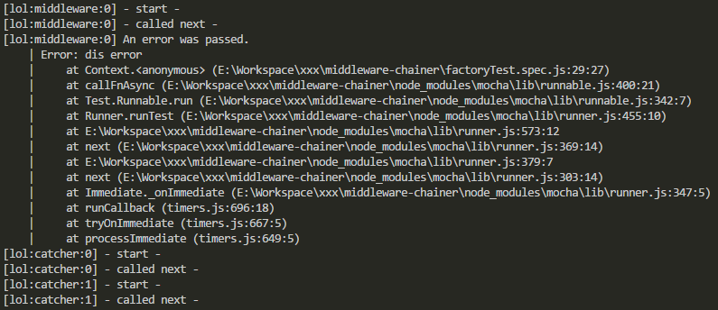
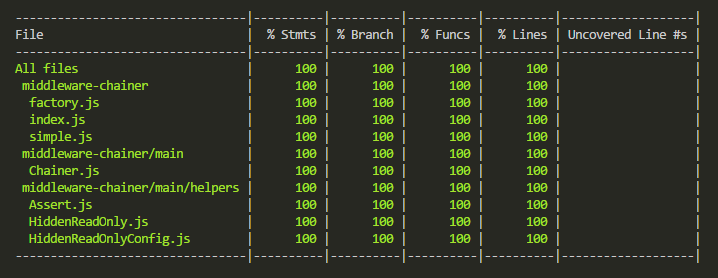

# middleware-chainer-1.0.0

Simplifies Node.js [express](https://expressjs.com/) [middlewares](https://expressjs.com/en/guide/using-middleware.html) modularization.

Best for those currently stuck with [swagger-node](https://www.npmjs.com/package/swagger) or alike; those that have limited means of middleware "chaining".

Basically behaves similarly to [express](https://expressjs.com/) [middlewares](https://expressjs.com/en/guide/using-middleware.html) (including error handling).

Make your code much more readable!
<br />&nbsp;&nbsp;&nbsp;&nbsp;&nbsp;&nbsp;&nbsp;&nbsp;_... and small enough to ease unit-testing!_

### Contents:
1. How-To?
    1. <a href="#basic">Basic Usage</a>
        1. <a href="#arguments">Basic Arguments/Parameters</a>
    1. <a href="#simple">Simple Usage</a>
    1. <a href="#factory">Factory Usage</a>
        1. <a href="#factory-arguments">Factory Arguments/Parameters</a>
1. <a href="#principles">Principles/Inspiration</a>
1. <a href="#coverage">100% Code Coverage</a>
1. <a href="#license">License</a>

## <a name="basic" />Basic Usage : `require('middleware-chainer')`

Here we have a simple authentication API endpoints:

```yaml
# ---------------------------------------------
# $BASEDIR/api/swagger/swagger.yaml
# ---------------------------------------------
paths:
  /auth:
    x-swagger-router-controller: auth
    post:
      operationId: login
      description: User Authentication/Authorization (Generate Token)
      # ...
    delete:
      operationId: logout
      description: Invalidate User Token/s
      # ...
```

Here's the controller:

```javascript
/**
 * $BASEDIR/api/controllers/auth.js
 */
const chain = require('middleware-chainer');

const loginHitCounter = require('./auth/login-hit-counter');
const loginErrorHandler = require('./auth/login-error-handler');

const login = require('./auth/login');
const logout = require('./auth/logout');

module.exports = {
  login: chain({ middlewares: [loginHitCounter, login, loginErrorHandler] }),
  logout: logout
};
```

In the example above, `login` has a "special 'pre' step (middleware)" prior to actual `login`, plus a special error handler.

Here's the would-be structure of the sample modularized [swagger-generated](https://www.npmjs.com/package/swagger) project above:

```
/swagger-project
|-- /controllers
|   |-- /auth
|   |   |-- login.js
|   |   |-- login.spec.js
|   |   |-- login-error-handler.js
|   |   |-- login-error-handler.spec.js
|   |   |-- login-hit-counter.js
|   |   |-- login-hit-counter.spec.js
|   |   |-- logout.js
|   |   |-- logout.spec.js
|   |-- auth.js
|   |-- auth.spec.js
|-- /swagger
|   |-- swagger.yaml
```

**Note:** `*.spec.js` being unit tests.

### <a name="arguments" />The `chain` Arguments

`chain`, pertaining to the variable where `require('middleware-chainer')` was assigned in the example above.

The `chain` function takes a single object literal `{}` as argument. Keys are as follows:

| Key | Type/Format | Description | Default | Example |
| --- | ----------- | ----------- | ------- | ------- |
| `name` | string | middleware name; shows in "debug" | `'mw-chain'` | `'lol'` |
| `loggers` | object literal (ie: `{}`) | see next two entries (`loggers.*`) | - | - |
| `loggers.debug` | function | receives "message" string as argument | `() => undefined` | `console.log` |
| `loggers.error` | function | receives "message" string as argument | `console.error` | `console.log` |
| `middlewares` | array of functions | array of middlewares `(req, res[, next])` or `(err, req, res, next)` | - | - |

Sample "full" configuration:

```javascript
const debug = require('debug'); // https://www.npmjs.com/package/debug
const chain = require('middleware-chainer');

const chainedMiddleware = chain({
  name: 'lol',
  loggers: {
    debug: debug,
    error: debug
  },
  middlewares: [...]
});
```

Sample output from one of the unit tests with configured `loggers.debug` w/ `console.log`:



**Hint**: Given the `loggers.error` has a default (`console.error`); you may opt to "mute" it by setting the value to: `() => undefined`.

## <a name="simple" />Simple Usage : `require('middleware-chainer/simple')`

```javascript
/**
 * $BASEDIR/api/controllers/auth.js
 */
const chain = require('middleware-chainer/simple');

const loginHitCounter = require('./auth/login-hit-counter');
const loginErrorHandler = require('./auth/login-error-handler');

const login = require('./auth/login');
const logout = require('./auth/logout');

module.exports = {
  login: chain(loginHitCounter, login, loginErrorHandler),
  logout: logout
};
```

No fuss. **Simple... Just middlewares**.

## <a name="factory" />Factory Usage : `require('middleware-chainer/factory')`

```javascript
/**
 * $BASEDIR/api/controllers/auth.js
 */
const ChainFactory = require('middleware-chainer/factory');

const loginHitCounter = require('./auth/login-hit-counter');
const loginErrorHandler = require('./auth/login-error-handler');

const loginChain = new ChainFactory({ // or `ChainFactory({})`
  name: 'login-chain',
  loggers: { debug: console.log },
  before: [loginHitCounter],
  after: [loginErrorHandler]
});

const login = require('./auth/login');
const refresh = require('./auth/refresh-token');
const logout = require('./auth/logout');

module.exports = {
  login: loginChain(login), // chain(loginHitCounter, login, loginErrorHandler)
  refresh: loginChain(refresh), // chain(loginHitCounter, refresh, loginErrorHandler)
  logout: logout
};
```

<a name="factory-arguments" />Constructor arguments are very much the same as the "basic", apart from one omission and two additions:

| Key | Type/Format | Description | Default | Example |
| --- | ----------- | ----------- | ------- | ------- |
| ~~`middlewares`~~ | ~~array of functions~~ | ~~array of middlewares `(req, res[, next])` or `(err, req, res, next)`~~ | - | - |
| `before` | array of functions | middlewares to be put at the **beggining** of the "chain" | - | - |
| `after` | array of functions | middlewares to be put at the **end** of the "chain" | - | - |

## <a name="principles" />Principles/Inspiration

As described in this Wikipedia [page](https://en.wikipedia.org/wiki/Unit_testing#Description), UNIT TESTING is described: "Intuitively, one can view a unit as the smallest testable part of an application". Therefore, being able to break-apart your application into smallest possible (sensible) modules is BEST!

If you employ/enforce the ideals of "single responsibility" per-class/file/module; [`middleware-chainer`](https://www.npmjs.com/package/middleware-chainer) is an easy go-to.

## <a name="coverage" />100% Code Coverage

See for yourself!

1. Clone:
    ```bash
    git clone https://github.com/jpbaking/middleware-chainer.git
    ```
1. ...of course go into folder:
    ```bash
    cd middleware-chainer
    ```
1. Download/install dependencies:
    ```bash
    npm install
    ```
1. Test!!!
    ```bash
    npm test
    ```
1. Expected output:
<br />

## <a name="license" />License

### MIT License

#### Copyright (c) 2018 Joseph Baking

Permission is hereby granted, free of charge, to any person obtaining a copy of this software and associated documentation files (the "Software"), to deal in the Software without restriction, including without limitation the rights to use, copy, modify, merge, publish, distribute, sublicense, and/or sell copies of the Software, and to permit persons to whom the Software is furnished to do so, subject to the following conditions:

The above copyright notice and this permission notice shall be included in all copies or substantial portions of the Software.

**THE SOFTWARE IS PROVIDED "AS IS", WITHOUT WARRANTY OF ANY KIND, EXPRESS OR IMPLIED, INCLUDING BUT NOT LIMITED TO THE WARRANTIES OF MERCHANTABILITY, FITNESS FOR A PARTICULAR PURPOSE AND NONINFRINGEMENT. IN NO EVENT SHALL THE AUTHORS OR COPYRIGHT HOLDERS BE LIABLE FOR ANY CLAIM, DAMAGES OR OTHER LIABILITY, WHETHER IN AN ACTION OF CONTRACT, TORT OR OTHERWISE, ARISING FROM, OUT OF OR IN CONNECTION WITH THE SOFTWARE OR THE USE OR OTHER DEALINGS IN THE SOFTWARE.**
